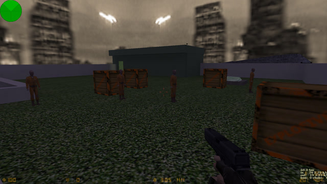
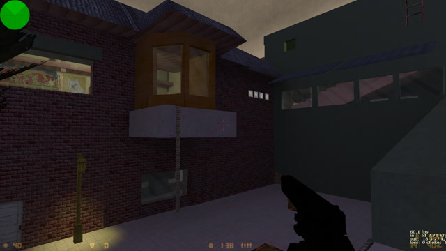
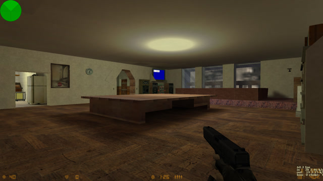
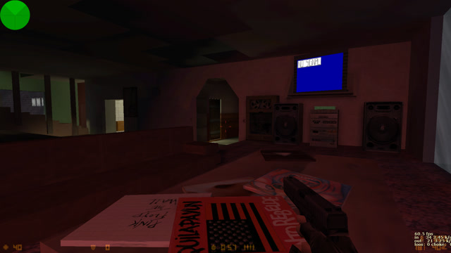
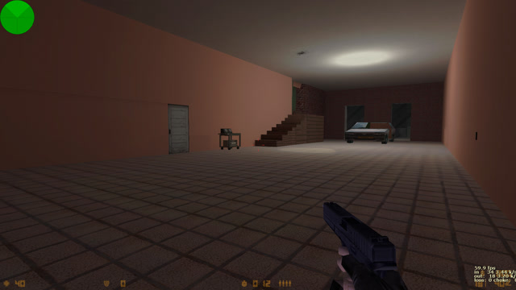
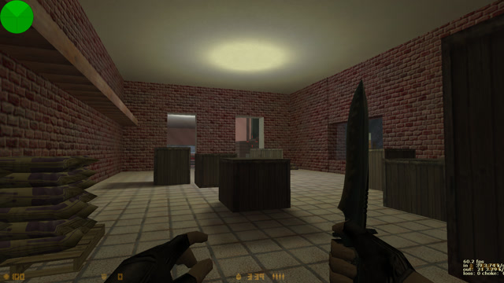

# **MI_CASA2**  
#### Mapa para Counter Strike 1.6  
---
### Instrucciones de instalacion:

Descargar el ultimo [release](https://github.com/trotskylenin/mi_casa2/releases) en formato .zip y descomprimirlo dentro de la carpeta "cstrike" (Generalmente ubicada en "C:\\Archivos de Programa (x86)\\Valve\\cstrike").

### Fuente (source):
En este repositorio podran encontrar los archivos necesarios para editar el mapa dentro de la carpeta [src](src).  
Para abrir estos archivos necesitan primero los siguientes programas:  

#### Prerequisitos:  
- **[Valve Hammer Editor 3.4 (Goldsource)](https://gamebanana.com/tools/5026)** (Editor de mapas .RMF)
- **[Wally](https://gamebanana.com/tools/4774)** (Editor de texturas .WAD)  
- **[Vluacn's ZHLT](https://forums.svencoop.com/showthread.php/40983-Downloads-amp-Changelogs)** (Compilador avanzado de mapas)  

### Capturas de pantalla:
  

